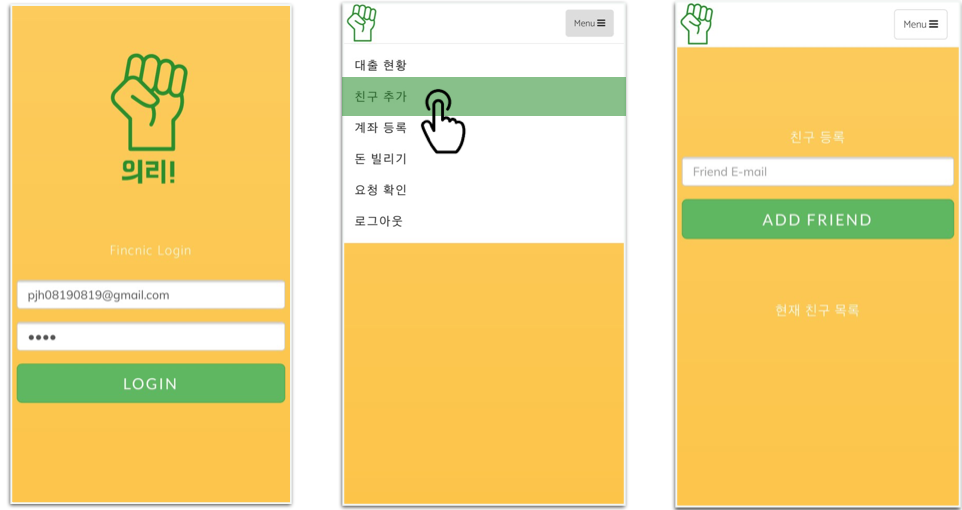
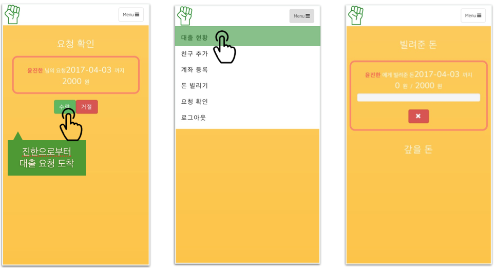

# 친구 간 간편 소액 대출 웹어플리케이션(IOS, Android)

euRi
=============

-------------

## 개요
 2017 금융API를 활용한 핀테크 해커톤에 출전하여 개발한 "의리!"라는 애플리케이션입니다. 친구 핸드폰 번호로 수수료가 발생하지 않는 금액 안에서 요청 메시지를 보내게 되면 친구는 메시지를 받고 빌려줄 여부를 결정하게 됩니다. 모든 기록은 DB에 저장되고 확인할 수 있습니다. 실제로 해당 앱은 가상계좌를 발급받아 출/입금이 가능하며 금융API 사용을 위해서 'KISA'에서 제공하는 네트워크를 이용해야합니다.

## 실행 방법
-------------

유저 - 친구 등록

유저 - 현황 확인

#### 시연 영상에 자세한 실행 방법이 있습니다.

## 시연 영상
-------------

